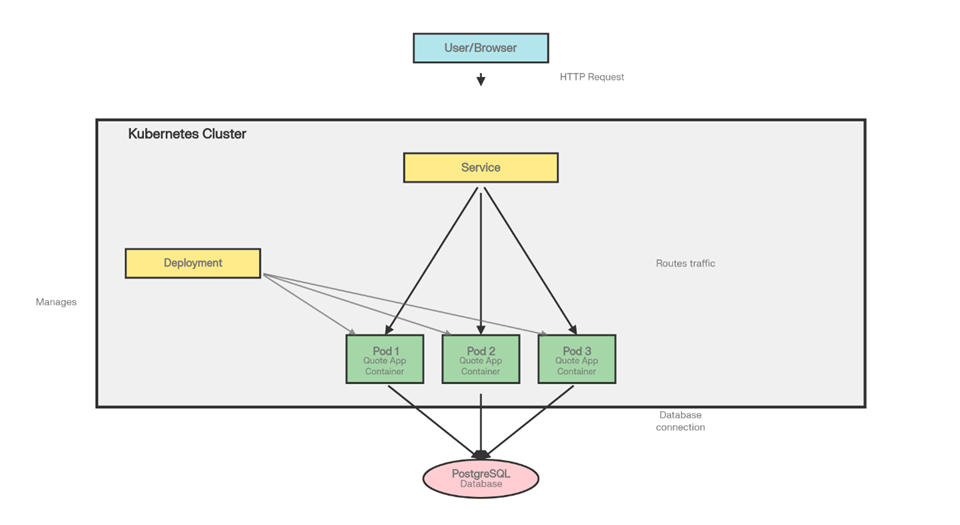

# Kubernetes Architecture Notes

---

## Map the Current Architecture

---

## 1 - Where does isolation happen?

### Container Level  
Isolation des processus et du système de fichiers via les namespaces et cgroups Linux.  
Les conteneurs partagent le noyau de l'hôte mais ne voient pas les autres processus.

### Pod Level  
Isolation réseau (chaque Pod a sa propre IP) et contexte d'exécution.

### Kubernetes Namespace Level  
Isolation logique des ressources au sein du cluster (ex : dev vs prod).

---

# What restarts automatically?

### Pods  
Si le processus de l'application plante ou si la livenessProbe échoue, le Kubelet redémarre le conteneur.

### Missing Replicas  
Si un Pod est supprimé manuellement, le Deployment (via le ReplicaSet) en crée un nouveau pour respecter le nombre de répliques désiré.

---

# What does Kubernetes not manage?

- Le matériel physique : serveurs, routeurs, disques physiques  
- L'OS des nœuds : mises à jour du noyau ou de l'OS hôte  
- La logique applicative : bugs de code, schémas de base de données  
- La persistance des données par défaut : sans PersistentVolume, les données d'un Pod sont perdues à sa suppression  

---

# Compare Containers and Virtual Machines

| Caractéristique | Conteneurs | Machines Virtuelles (VM) |
|---------------|------------|---------------------------|
| Partage du noyau | Partagé avec l'OS hôte | Noyau complet et indépendant par VM |
| Temps de démarrage | Secondes (ou millisecondes) | Minutes (boot complet de l'OS) |
| Surcharge (Overhead) | Faible (MBs), processus natifs | Élevée (GBs), OS invité complet + hyperviseur |
| Isolation de sécurité | Isolation logicielle (namespaces) – plus faible | Isolation matérielle (virtuelle) – plus forte |
| Complexité opérationnelle | Portable, immuable, orchestré par API | Gestion de patchs OS, configuration lourde |

---

# When would you prefer a VM?

Pour des applications nécessitant une isolation de sécurité stricte (multi-tenant hostile), des noyaux OS spécifiques, ou des applications monolithiques héritées (legacy) difficiles à conteneuriser.

---

# When would you combine both?

Presque toujours dans le cloud.  

On utilise des VMs pour créer les nœuds du cluster Kubernetes (isolation infrastructure), et on y fait tourner des conteneurs (agilité applicative).

---

## 3 - Introduce Horizontal Scaling

### What changes when you scale?

- Le nombre de Pods (répliques) augmente  
- Le Service distribue désormais le trafic entre plusieurs IPs de Pods (Load Balancing)  
- La disponibilité de l'application augmente  

### What does not change?

- L'adresse IP du Service (ClusterIP) reste la même  
- La configuration du Deployment (image, variables d'environnement)  
- La base de données (toujours la même instance unique partagée)  

---

## 4 - Simulate Failure

### Who recreated the Pod?

Le ReplicaSet (contrôlé par le Deployment).

### Why?

Pour maintenir l'état désiré (*Desired State*).  

Le Deployment spécifie par exemple "3 répliques".  
Si une disparaît, la boucle de réconciliation de Kubernetes détecte l'écart (3 vs 2) et crée un nouveau Pod.

### What would happen if the node itself failed?

Après un délai (timeout), le Scheduler Kubernetes détecterait que le nœud est "NotReady" et reprogrammerait les Pods manquants sur d'autres nœuds sains du cluster.

---

## 5 - Introduce Resource Limits

### What are requests vs limits?

**Requests** :  
Le minimum garanti. Le Scheduler l'utilise pour décider sur quel nœud placer le Pod.  
Si un nœud n'a pas assez de RAM libre pour la request, le Pod ne s'y lance pas.

**Limits** :  
Le plafond absolu.

- CPU : si dépassé → le conteneur est ralenti (*throttled*)  
- RAM : si dépassé → le conteneur est tué (*OOMKilled*)  

### Why important in multi-tenant systems?

Pour éviter le problème du *Noisy Neighbor*.  

Sans limites, une application buggée pourrait consommer 100% du CPU/RAM du nœud et faire planter toutes les autres applications hébergées dessus.

---

## 6 - Add Readiness and Liveness Probes

### Difference between readiness and liveness

**Liveness Probe**  
- Vérifie si l'application fonctionne  
- En cas d'échec → redémarre le conteneur  
- Cas d'usage : deadlocks, boucles infinies  

**Readiness Probe**  
- Vérifie si l'application peut recevoir du trafic  
- En cas d'échec → retire l'IP du Service (mais ne redémarre pas le Pod)  
- Cas d'usage : démarrage lent, surcharge temporaire  

### Why does this matter in production?

Cela garantit le *Zero-Downtime*.

Lors d'une mise à jour :
- Kubernetes n'envoie du trafic vers la nouvelle version que lorsqu'elle est **Ready**
- Si l'application plante, elle est redémarrée automatiquement (*self-healing*)

---

## 7 - Connect Kubernetes to Virtualization

### What runs underneath your k3s cluster?

Probablement des Machines Virtuelles (si cloud, Lima, WSL)  
ou directement du Bare Metal.

### Is Kubernetes replacing virtualization?

Non. Il l'abstrait.

- Kubernetes gère les applications  
- La virtualisation gère l'infrastructure  
- Ils sont complémentaires  

### Cloud Stack Examples

**Cloud Data Center**  
Serveur Physique → Hyperviseur → VM → Linux → Kubernetes → Conteneur  

**Embedded Automotive**  
Hardware → Hyperviseur temps réel → OS minimal → k3s → Conteneurs critiques  

**Financial**  
Serveur dédié → VM avec isolation stricte → Kubernetes dédié (pas de multi-tenant) → Conteneurs  

---

## 8 - Design a Production Architecture

### Architecture Proposée

**High Availability (HA)**  
Cluster Kubernetes avec au moins 3 Worker Nodes répartis sur plusieurs zones de disponibilité.

**Base de données**  
Sortie du cluster Kubernetes.  
Utilisation d'un service managé (ex : AWS RDS ou Google Cloud SQL) pour gérer backups, réplication et failover.

**Ingress Controller**  
Nginx ou Traefik pour gérer HTTPS et le routage.

**Monitoring**  
Prometheus + Grafana.

**Logging**  
EFK Stack (Elasticsearch, Fluentd, Kibana) ou Loki.

### Répartition

**In Kubernetes**
- Application Quote (stateless)
- Jobs
- Cache (Redis)
- Ingress Controller

**In VMs**
- Nœuds Kubernetes (Control Plane + Workers)

**Outside Cluster**
- PostgreSQL managé
- Registre d'images (Docker Hub / ECR)
- DNS
- Load Balancer Cloud

---

## 9 - Secret-Based Configuration

### Why is this better than plain-text?

- Sécurité : les mots de passe ne sont pas visibles dans Git ni dans `kubectl get deploy -o yaml`
- Gestion : mise à jour des secrets sans reconstruire l'image
- Contrôle d'accès : restriction via RBAC Kubernetes

### Is a Secret encrypted by default?

Non.

Par défaut :
- Encodé en Base64 (facilement décodable)
- Stocké dans la base etcd

Pour un vrai chiffrement :
- Activer **Encryption at Rest** au niveau de l'API Server

---

## 10 - Architecture Critique

### Single Point of Failure (SPOF)

La base PostgreSQL est une instance unique.  
Si elle tombe, l'application ne peut plus lire/écrire.

### Persistance

Si le Pod DB est supprimé, les données sont perdues  
(sauf si un PersistentVolumeClaim est configuré).

### Sécurité

Même avec des Secrets, utiliser le compte root/admin par défaut de la DB n'est pas recommandé.  
Principe du moindre privilège à appliquer.