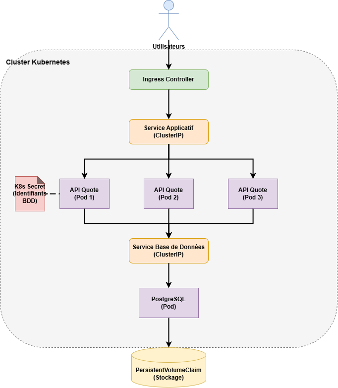

# Final Systems Challenge - Analyse de l'architecture Quote API

## Problèmes du système actuel

### Problème 1 : Pod unique avec base de données dans le même conteneur

**Quel est le problème ?**
L'architecture actuelle exécute l'API Quote et la base de données PostgreSQL dans le même conteneur. Cela viole le principe de responsabilité unique et les bonnes pratiques des conteneurs.

**Pourquoi c'est important ?**
Les conteneurs doivent idéalement exécuter un seul processus. Mélanger application et base de données crée un couplage fort, rend le scaling impossible et complique la maintenance.

**Quels risques opérationnels ?**
- Si l'application plante, la base de données tombe aussi
- Impossible de scaler les réplicas API indépendamment de la base de données
- Les données sont perdues lors du redémarrage du pod
- Contention des ressources entre les processus applicatifs et la base de données

### Problème 2 : Pas de stockage persistant pour la base de données

**Quel est le problème ?**
Les données PostgreSQL sont stockées dans le système de fichiers éphémère du conteneur sans PersistentVolumeClaim.

**Pourquoi c'est important ?**
Les conteneurs sont stateless par conception. Lorsqu'un pod redémarre ou est replanifié, toutes les données internes sont perdues.

**Quels risques opérationnels ?**
- Perte totale des données au redémarrage du pod
- Impossibilité de faire des mises à jour continues sans interruption
- Pas de sauvegarde ou de migration possible
- La base de données devient un point de défaillance unique

### Problème 3 : Variables d'environnement en clair pour les secrets

**Quel est le problème ?**
Les identifiants de base de données et configurations sensibles sont stockés en texte clair dans les variables d'environnement du Deployment.

**Pourquoi c'est important ?**
Les variables d'environnement sont visibles en clair via `kubectl describe pod`, les logs des conteneurs et les listes de processus.

**Quels risques opérationnels ?**
- Secrets exposés dans le contrôle de version si les manifests sont commités
- Toute personne avec accès lecture sur les pods peut voir les credentials
- Pas d'audit sur l'accès aux secrets
- Risque de faille de sécurité si etcd est compromis

### Problème 4 : Absence de sondes readiness/liveness

**Quel est le problème ?**
L'application n'a pas de vérifications de santé configurées.

**Pourquoi c'est important ?**
Sans sondes, Kubernetes continue d'envoyer du trafic vers les pods défaillants.

**Quels risques opérationnels ?**
- Trafic envoyé vers des pods en initialisation ou plantés
- Pods défaillants non détectés et non redémarrés automatiquement
- Les rolling updates peuvent remplacer tous les pods simultanément

### Problème 5 : Pas de limites de ressources

**Quel est le problème ?**
Les conteneurs n'ont pas de limites CPU/mémoire définies.

**Pourquoi c'est important ?**
Sans limites, un conteneur défaillant peut consommer toutes les ressources du nœud.

**Quels risques opérationnels ?**
- Un pod peut affamer les autres workloads sur le même nœud
- Instabilité du nœud et défaillances en cascade
- Pas de caractéristiques de performance prévisibles

### Problème 6 : Remplacement immédiat des pods lors des déploiements

**Quel est le problème ?**
Le Deployment utilise la stratégie par défaut sans sondes de readiness appropriées.

**Pourquoi c'est important ?**
Sans sondes, Kubernetes ne peut pas déterminer quand les nouveaux pods sont prêts.

**Quels risques opérationnels ?**
- Interruption de service pendant les déploiements
- Erreurs utilisateurs pendant le rollout
- Pas de rollback automatique sur déploiement échoué

### Problème 7 : Dépendance à un seul nœud

**Quel est le problème ?**
Le système entier tourne sur un seul nœud sans configuration de haute disponibilité.

**Pourquoi c'est important ?**
Si le nœud tombe en panne, l'application devient indisponible.

**Quels risques opérationnels ?**
- Panne complète du service en cas de défaillance matérielle
- Pas de tolérance aux pannes
- Les opérations de maintenance nécessitent des interruptions

---

## Architecture de production

### Vue d'ensemble de l'architecture

L'architecture production-ready sépare les responsabilités et implémente les patterns Kubernetes appropriés :
